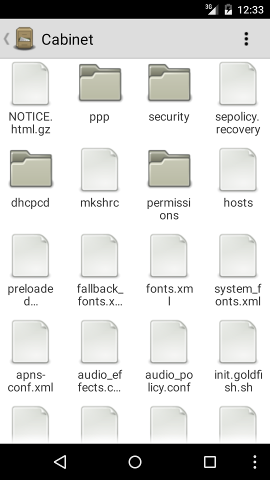

Cabinate - File Manager for Android
===================================

<h2>Cabinate - is a simple android file manager for my personal use</h2>

<h2>Building The Source Code</h2>

- I prefer building via the command line on GNU/Linux. On my machine I have the following env variables set correctly:

  `JAVA_HOME`    - JDK installation dir

  `ANDROID_HOME` - Android SDK installation dir

  `PATH`         - contains $GRADLE_HOME/bin $ANDROID_HOME/tools $ANDROID_HOME/platform-tools and JAVA_HOME/bin

  Where, $GRADLE_HOME is this directory where Gradle is installed.

- Build the debug apk via:

  `gradle --daemon assembleDebug`

- Install the debug apk via:

  `adb -s DEVICE_ID install -r build/outputs/apk/cabinate-debug.apk`

  Where, DEVICE_ID is the obtained via: `adb devices -l`

<h2>Status</h2>

- This codebase is very much work in progress.
- As of now, I only care about making it work on my phone which runs Android 5.1.1 (API level 22)

